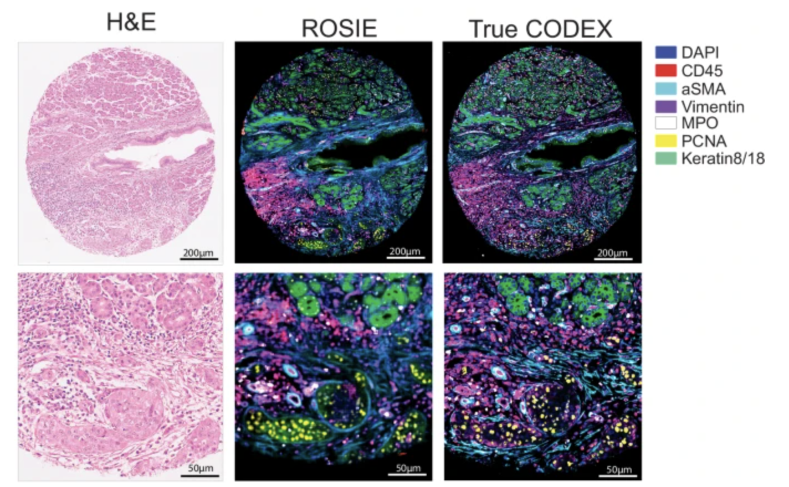

# ROSIE Model: Training and Evaluation




This repository contains code for training and evaluating the **ROSIE model**, designed for **H&E to multiplex protein prediction** in histopathology images.

---

## Overview

The ROSIE model predicts multiplex protein expression from H&E-stained histopathology images.  
The evaluation script processes H&E images (both **ZARR** and **PNG** formats) and generates protein expression predictions across **50 channels**.

---

## Data and Model Access


To request access to the pretrained model weights, you can visit the [Hugging Face Model Repository](https://huggingface.co/ericwu09/ROSIE).
To request access to the training data, please contact alex@enablemedicine.com and aaron@enablemedicine.com.

---

## Installation

Install the required dependencies:

```
pip install -r requirements.txt
```


---

## Example Usage

Process a single H&E image to generate multiplex protein predictions:

```
python evaluate.py
--input_dir /path/to/he/images
--output_dir /path/to/output
--model_path /path/to/model.pth
```


**Output:**  
- A `.tiff` image file with **50 channels**.  
- Channels correspond to the following biomarkers:

`DAPI, CD45, CD68, CD14, PD1, FoxP3, CD8, HLA-DR, PanCK, CD3e, CD4, aSMA, CD31, Vimentin, CD45RO, Ki67, CD20, CD11c, Podoplanin, PDL1, GranzymeB, CD38, CD141, CD21, CD163, BCL2, LAG3, EpCAM, CD44, ICOS, GATA3, Gal3, CD39, CD34, TIGIT, ECad, CD40, VISTA, HLA-A, MPO, PCNA, ATM, TP63, IFNg, Keratin8/18, IDO1, CD79a, HLA-E, CollagenIV, CD66`

For example:  
- Channel 0 → DAPI  
- Channel 1 → CD45  
- ... and so on.

**Postprocessing:**  
Several postprocessing algorithms are available via the `--postprocess_image` flag. These adjust channel intensities for human-viewable ranges.  
- Note: Min/max intensity depends on protein marker expression in each sample.  
- For **quantitative analysis**, use raw output values.

---

## Directory Structure

### Core Scripts
- **`evaluate.py`** — Evaluation and inference script. Runs inference on H&E images, predicts protein expression, outputs TIFF files.  
- **`train.py`** — Training script implementing ConvNeXt-based architecture, patch-based training, augmentation, and evaluation.  
- **`utils.py`** — Utility functions for image analysis, ML tasks, metrics, data loading, and visualization.  
- **`patch_to_cell.py`** — Converts patch-level predictions into cell-level measurements using segmentation masks.  
- **`process_exp.py`** — Processes H&E images into expression predictions and cell-level measurements.  
- **`reconstruct_codex.py`** — Reconstructs CODEX images from parquet patch-level expression data.

> **Note:** Most scripts require dependencies and configurations specific to our development environment. However, `evaluate.py` can be run directly with the dependencies listed in `requirements.txt`.

### Configuration and Data Files
- **`requirements.txt`** — Python dependencies.  
- **`Training Datasets.csv`** — Metadata for training datasets.  
- **`Antibody Information.xlsx`** — Antibody and biomarker details for the 50 protein channels.

---

## Citation

If you use this repository in your research, please cite:  
Wu, Eric, et al. "ROSIE: AI generation of multiplex immunofluorescence staining from histopathology images." Nature Communications 2025.
👉 [ROSIE, Nature Communications 2025](https://www.nature.com/articles/s41467-025-62346-0)

---

## License

This project is licensed under the **MIT License**.  
See the [LICENSE](LICENSE) file for details.

---
